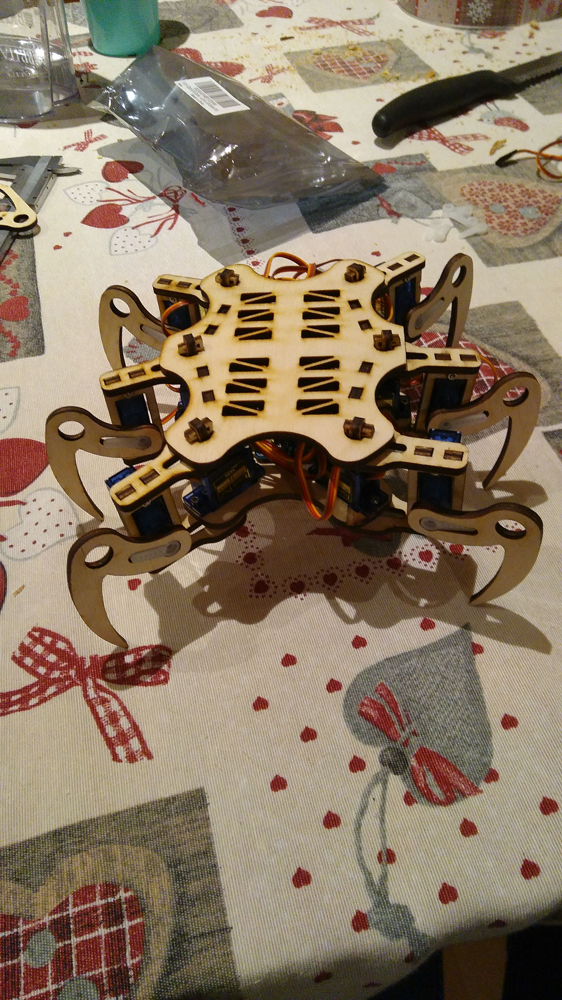

# bot
This is the common workspace for the bot project : A consortium of charming people working together to achieve the ultimate goal of satisfying the desire to build an awesome robot.

 

## parts: 
| Nbr | Description | Link |
| --- | --- | --- | 
| 1 | servo controll board | https://www.banggood.com/3Pcs-PCA9685-16-Channel-12-bit-PWM-Servo-Motor-Driver-I2C-Module-For-Arduino-Robot-p-1188110.html?rmmds=search&cur_warehouse=CN
| 12 | miro-servo SG90 9G | https://www.ebay.co.uk/i/162527206943?chn=ps&adgroupid=49939730778&rlsatarget=pla-380792710264&abcId=1129946&adtype=pla&merchantid=115117200&poi=&googleloc=1006598&device=c&campaignid=974198600&crdt=0
| 24 | screw M2x8 | - |
| 24 | bolt M2 | - |
| 2 | A4 laserable material 4mm | - |

## libs
Adafruit PCA9685:
https://github.com/adafruit/Adafruit-PWM-Servo-Driver-Library

## usefull link:
https://www.thingiverse.com/thing:2755973
